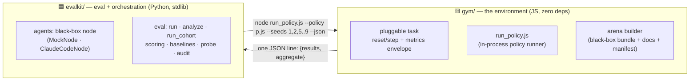
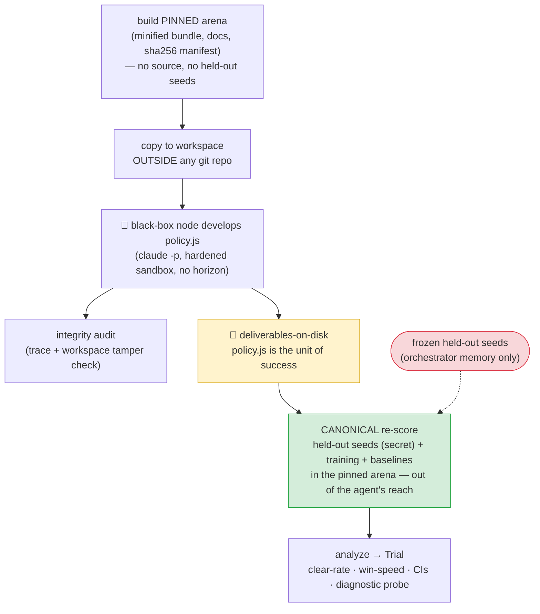
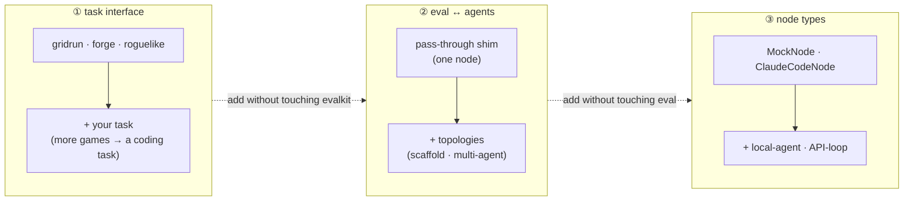

<div align="center">

# 🛡️ Gauntlet

### A determinism-first framework for evaluating LLM agents on **long-horizon** tasks

*An agent is a **black box** that writes a **policy**. Gauntlet scores that policy on **held-out instances it never saw**, in a **canonical environment it cannot reach** — then tells you **why** it failed, not just how much it scored.*

     

</div>

---

## Why gauntlet

Most LLM benchmarks are **short-horizon**: one prompt, one gradable answer. Real agentic work is not — it unfolds over hundreds of tool calls and hours of wall-clock, where the failures are *accumulation* failures (drift, context loss, giving up, over-fitting to what was tried) rather than single-step mistakes. Gauntlet is built to measure exactly that, with four properties most eval harnesses lack:

- 🎯 **Discriminating** — cleanly separates frontier models (and *why* they differ, not just *that* they do).
- 🔬 **Diagnostic** — localizes the failure: a held-out generalization gap, a failure-mode breakdown, position against baselines.
- 🔒 **Tamper-proof** — the agent develops in a sandbox; its policy is re-scored on **secret held-out seeds in a pinned arena outside its reach**. A cheating workspace cannot move the score (proven by a tamper test).
- 🪨 **Robust** — across a real study, **21 multi-hour sessions, 9 interrupted by 6 distinct failure modes** (incl. a mid-run provider access retraction) → **zero data lost**.

> 📄 The full study lives in **[`REPORT.md`](REPORT.md)** — a four-model capability ladder + a controlled "does a cognitive scaffold help?" ablation, every number reproduced by committed scripts.

---

## How it works

Gauntlet is **two small libraries with one narrow boundary**. The environment is JavaScript; the orchestration is Python; they talk once per *batch of seeds*, never per step.



**The boundary is the contract.** `evalkit` depends only on [`gym/core/CONTRACT.md`](gym/core/CONTRACT.md) — a task-agnostic interface — never on any task's internals. Add a task without touching Python; add an agent kind or a coordination topology without touching the gym.

### The trial lifecycle

A trial is one black-box agent session, end-to-end. Everything that protects validity is in this picture:



### Three load-bearing properties

| | property | why it matters |
|---|---|---|
| **1** | **Determinism** — every episode is a pure function of `(seed, action sequence)`; all randomness flows through one seeded PRNG. | Held-out scoring is cheap, replayable, and tamper-evident. Verified by a 3-way trajectory-hash battery + state-only golden hashes. |
| **2** | **Canonical scoring outside the agent's reach** — the final policy is re-scored in the pinned arena on seeds that exist only in orchestrator memory. | A tampered workspace *cannot* move the score (tamper-test proven). A per-trial **parity gate** confirms the agent's runner and the scorer agree per-seed. |
| **3** | **Deliverables-on-disk** — a `policy.js` that exists gets scored, however the session ended. | The framework loses nothing under crashes, kills, rate-limits, and provider outages. |

### Three seams (designed for extension, minimal to build)



---

## Quickstart

```bash
# 1. environment library — 129 tests (contract conformance, determinism,
#    golden trajectories, runner semantics, arena build, cross-runner determinism)
cd gym && npm install && npm test

# 2. eval library — 69 tests (mock e2e, tamper, crash+resume, audit, cohort, external ingest)
cd ../evalkit && python3 -m pytest -q
```

Run a trial from Python — **a few API functions, no CLI**:

```python
import evalkit
from evalkit.agents import ClaudeCodeNode, MockNode, NodeBudgets

# free, no tokens — a fixed policy through the full pipeline:
trial = evalkit.run("gridrun", MockNode(policy_source=open("baseline.js").read()))

# a real agent session (hardened claude -p sandbox, no artificial horizon):
node  = ClaudeCodeNode(model="claude-opus-4-8", effort="max")
trial = evalkit.run("roguelike", node, budgets=NodeBudgets(wall_clock_s=8*3600))

analysis = evalkit.analyze(trial)        # held-out dists + baselines + diagnostic probe
print(analysis.render())

# many models × N reps, one frozen held-out draw, in parallel:
evalkit.run_cohort("roguelike", arms=[...], n_heldout=80, concurrency=4)
```

`evalkit.run` builds a pinned arena → copies it to a neutral out-of-repo workspace → lets the node develop `policy.js` under a strict tool allowlist with a process-group wall-clock kill → audits the trace + workspace → **re-scores the final policy on held-out + training seeds in the canonical arena** → runs the task's baselines → persists a fully reloadable `Trial`. Crash mid-run? `evalkit.resume(trial_dir)` re-enters at the scoring stage.

---

## The task contract (add your own)

A task is a directory under `gym/tasks/<id>/` whose `env.js` exports `{ meta, createEnv }` and fills a **task-agnostic metrics envelope** every step:

```js
obs.metrics = {
  score,                       // composite reference (publish the formula; cap farmable parts)
  progress,                    // 0..1, monotonic; 1.0 = task cleared
  done_reason,                 // null | "win" | "death" | "timeout"
  // ...any task-specific numbers/booleans — aggregated generically by introspection
}
```

`evalkit` never names a task's fields — numbers become distributions, booleans become rates, `done_reason` becomes a rates object. A **conformance suite** mechanically enforces the contract (determinism battery, monotone progress, sanitize-never-throw, terminal idempotence, JSON-safety, reserved-key hygiene) for *every* registered task. Tasks declare their own **comparable** (`meta.criterion`) — e.g. the roguelike's *win-first, then win-fast*.

Three tasks ship today, structurally different on purpose:

| task | shape | episode |
|---|---|---|
| **`gridrun`** | spatial — 3-floor grid crawler (key, locked exit, patrolling hazards, boon decisions) | ≤400 steps, ~0.3 ms |
| **`forge`** | economic (non-spatial) — materials market, crafting, upgrades, trader offers, net-worth target | 60 days, ~0.05 ms |
| **`roguelike`** | the headline — a vendored bullet-hell shoot-'em-up; clear a **~19.3M-HP boss chain** | ≤90k steps, ~0.5–1.5 s |

---

## What the first study found

Four Claude models on the roguelike, one **frozen 80-seed held-out draw**, criterion = *win, then win fast* — full detail and reproducibility in **[`REPORT.md`](REPORT.md)**.

### 📈 A clean, statistically separated capability ladder

| model | clear rate (Wilson 95%) | win-step median | clean N |
|---|---|---|---|
| **Haiku 4.5** | **0.0%** (0/320) | — | 4 |
| **Sonnet 4.6** | **5.3%** (17/320) | 54k | 4 |
| **GPT-5.5 / xhigh** ‡ | **17.9%** (43/240) | 60k | 3 (external) |
| **Opus 4.8** | **47.1%** (113/240) | 64.5k | 3 |
| **Fable 5** | **86.3%** (69/80) | **40.6k** | 1† |

Every adjacent rung separates at **p < 1e-4** (Haiku ≪ Sonnet ≪ GPT-5.5 ≪ Opus ≪ Fable). A second axis — **win-speed** — distinguishes the top two beyond clear-rate: *Fable wins ~37% faster than Opus despite both clearing reliably.*

> ‡ **GPT-5.5/xhigh is an *external* manual trial** (OpenAI Codex), the first non-Claude rung — developed in a different harness, then **ingested through gauntlet's canonical scorer** (`evalkit.ingest_external_trial`) after **byte-identical substrate + prompt verification (sha256)**. Gauntlet reproduced the foreign pipeline's own numbers to the digit. This is gauntlet's **cross-provider comparability** in action: any policy drops into the same ladder once the two sha gates pass. †Fable is N=1 by **force majeure** (provider access withdrawn mid-study).

### 🧪 Does a cognitive scaffold help? — a controlled honest-negative

Same arms, same seeds, **one change**: an added *observe → plan → implement → evaluate* loop with a required written memory. The scaffold is **followed strongly** (agents maintain a real world-model + worklog, survive 10 auto-compactions, run the full loop) — yet **moves the clear-rate on no tier**:

| model | bare → +cognitive | p |
|---|---|---|
| Haiku | 0.0% → 0.0% | 1.0 |
| Sonnet | 5.3% → 5.0% | 0.91 |
| Opus | 47.1% → 43.8% | 0.46 |

The limiter is **coder execution / raw difficulty**, not the absence of a thinking scaffold — exactly where the design predicted the constraint would migrate.

### 🪨 Robustness as a result

The cohort was, unintentionally, a brutal reliability test: **21 sessions, 9 interrupted across 6 distinct failure modes** — operator kills, three account session-limit deaths, an API socket drop, a SIGTERM, and an **unannounced provider-side retraction of a model mid-run**. Every interrupted session was recovered or honestly recorded; **zero artifacts lost**. For a scientific instrument, surviving infrastructure chaos uncorrupted is itself a headline.

---

## Repository layout

```
gym/                       🟨 Lib1 — the environment (JavaScript, zero runtime deps)
  core/                       CONTRACT.md · prng.js · episode.js · aggregate.js
  runner/run_policy.js        the per-batch JSON runner (also bundled into arenas)
  tasks/<id>/                 env.js · DESCRIPTION.md · INTERFACE.task.md · baselines/
  arena/build_arena.js        task → pinned black-box arena (+ sha256 manifest)
  tests/                      zero-dep conformance + determinism suite (129)
evalkit/                   🟦 Lib2 — eval + orchestration (Python, stdlib only)
  evalkit/agents/             the black-box node seam (MockNode · ClaudeCodeNode)
  evalkit/eval/               run · analyze · run_cohort · cross_score · resume · ingest_external_trial · criterion · audit · probe
  tests/                      69 tests (mock e2e · tamper · crash+resume · audit · external ingest)
experiments/                 reproducible study drivers + committed analysis + results
runs/                        trial artifacts (gitignored bulk; never deleted)
REPORT.md  DESIGN.md  SPEC_framework.md  gym/core/CONTRACT.md   ← the docs that matter
```

---

## Reproducibility

Every headline number is recomputed from persisted artifacts by committed, byte-reproducible scripts:

```bash
python3 experiments/cohort-v2/master_analysis.py        # the capability ladder (→ master_analysis.json)
python3 experiments/scaffold-mono/cog_vs_bare.py        # the cognitive ablation (→ cog_vs_bare.json)
```

Each trial records its task version + bundle sha256, the frozen seed split, the gauntlet git SHA (stamped at run start), model/CLI/OS versions, context window, compactions, cost, and turns. Determinism means any policy re-scores byte-identically. Nothing in `runs/` is ever deleted; partial/terminated runs are archived separately and excluded from clean statistics.

---

## Status & roadmap

**Built and verified:** the two libraries, the three load-bearing properties, three small + one large task, the cohort runner, the full bare-vs-cognitive study. Tests green (gym 129/129, evalkit 63/63).

**Designed-but-unbuilt (the seams accommodate them):** a non-game (coding/algorithm) task for cross-domain generality; a local-agent node kind; multi-agent coordination topologies; live-observability heartbeat.

---

## Documents

| file | what it is |
|---|---|
| **[`REPORT.md`](REPORT.md)** | the canonical study — architecture, the game, results, robustness, reproducibility |
| **[`DESIGN.md`](DESIGN.md)** | architecture decisions and the shape of the three seams |
| **[`gym/core/CONTRACT.md`](gym/core/CONTRACT.md)** | the task-interface contract (write a task against this) |
| **[`SPEC_framework.md`](SPEC_framework.md)** | the original north-star spec |

## Acknowledgements & license

The `roguelike` task wraps a deterministic headless port of a third-party bullet-hell mini-game, used **only as a benchmark substrate**; all credit for the game itself belongs to its original authors. Framework code is **MIT**-licensed.

<div align="center"><sub>Built with Claude Code. Research code — clear, tested, and honest about its limits.</sub></div>
